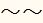
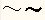
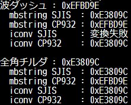

# 文字コードの話

----

### 文字コードってなぁに？

wikipedia 大先生より

	文字コード（もじコード）はコンピュータ上で文字（キャラクタ (コンピュータ)）を
    利用するために各文字に割り当てられるバイト表現。
	もしくは、バイト表現と文字の対応関係（文字コード体系）のことを指して
    「文字コード」と呼ぶことも多い。

ここでは業務で使うであろう文字コードについて扱います。
歴史的な話とか興味あれば調べてください。

文字コードという名前自体が割と広義で使われていて、  
割と曖昧な単語な気がしないでもないですが  
ここではスルーします。

---

### ASCII

* 最も基本となる文字コード
* 1文字1バイト（ほんとは7ビット）
* 制御文字＋英数字＋記号のみで構成されている

```
0x00 - 0x1F  制御文字
0x20         空白
0x21 - 0x7E  英数字と記号
0x7F         制御文字（DEL）
```

---

### 日本語に対応したい！！

 ---

### 標準となる文字集合を策定だ！

 ---

### 文字集合ってなぁに？

wikipedia 大先生より

	文字集合（もじしゅうごう、英: character set）は、
    文字（キャラクタ (コンピュータ)）をその要素（「元」）とする集合である。
    文字セットという場合もある。

 ---

分かりやすくいうと以下のような感じ


---

## 文字集合

 ---

### JIS X 0201

* ASCII + 半角カナ
* ASCIIの8ビット目を1にしてカタカナを割り当てている

```
0x00 - 0x7F  ASCII 領域
0xA1 - 0xDF  JISカナ(半角カナ)
```

 ---

### 一部 ASCII と違う文字がある

```
         ASCII              JIS X 0201
0x5C   バックスラッシュ    円記号
0x7E   チルダ              オーバーライン
```

キーボードのバックスラッシュを押すと\マークになるのはこれが原因

 ---

### JIS X 0208

* 全角ひらがな、カタカナ、記号、漢字
* 文字に区と点の番号が振られている

```
 01区～08区  各種記号、英数字、かな
 09区～15区  未定義（機種依存）
(13区        NEC拡張外字)
 16区～47区  JIS第一水準漢字
 48区～84区  JIS第二水準漢字
 85区～94区  未定義（機種依存）
(89区～92区  NEC拡張外字)
```

 ---

### Unicode

* 世界で使われる全ての文字を共通の文字集合にて利用できるようにしようという考え
* その影響でめちゃめちゃ範囲が広い
* 日本語からは JIS X 0201・JIS X 0208・JIS X 0212・JIS X 0213 の内容を収録している
* 文字にコードポイント（Unicodeスカラ値）と呼ばれる番号が振られている
* U+0000 ～ U+FFFF の4桁で表す（追加領域は5～6桁　顔文字、麻雀牌とかトランプとかある）
* 符号化の方法も言及されている

```
U+0000 - U+007F  ASCII 領域
U+0080 - U+00FF  ラテン1補助
・・・
U+3040 - U+309F  ひらがな
U+30A0 - U+30FF  カタカナ
```

 ---

### その他の文字集合

説明は割愛するので興味ある人は調べてみてください。

* JIS X 0212(補助漢字 JIS X 0208と組み合わせて使う)
* JIS X 0213(JIS X 0208の拡張、完全上位互換ではない）
* JIS X 0221
* iモード絵文字·EZweb絵文字·SoftBank絵文字
* 今昔文字鏡（こんじゃくもじきょう）
* JIPS（NEC開発）
* EBCDIC（アメリカIBM 汎用コンピュータ）
* GT書体（東京大学多国語処理研究会）
* KEIS（日立）
* IBM漢字システム（IBM DOS/V機）
* CID（Adobe)

---

### 覚えておけばいいのは大別して以下2つということ

 ---

### JIS 漢字コード系

* 文字に区と点の番号が振られている
* この番号を一定のルールで符号化したのがShift_JISとかEUC-JP等
* 符号化のルールが違うだけで指している番号は同じ

 ---

### Unicode 系

* 文字にコードポイント（Unicodeスカラ値）と呼ばれる番号が振られている
* 符号化方式も策定されている
* これを符号化したのがUTF-8とかUTF-16等

---

### ここまでまとめ


 ---

図を見ると「JIS X 0208 + JIS X 0212 = JIS X 0213」のように見えますが、
漢字の採用基準が違うので収録している漢字に差異があります。

JIS X 0212 が後述するShift_JISで表現できなかったため、JIS X0213 が作られた。

---

## エンコーディング

ようやくエンコーディングの話に

---

## JIS 漢字コード系

---

## Shift_JIS

* 1文字1バイト～2バイト
* JIS X 0201 + JIS X 0208 を符号化したもの
* 符号化ルールが割と複雑
* WindowsとかMacとか（正確には違う 後述）

 ---

### 判別

1バイト文字

```
0x00 - 0x7F もしくは 0xA1 - 0xDF
```

2バイト文字

```
1バイト目 0x81 - 0x9F もしくは 0xE0 - 0xFC
2バイト目 0x40 - 0x7E もしくは 0x80 - 0xFC
```

 ---

### 符号化ルール

JIS X 0201の範囲はそのまま。
JIS X 0208は文字に区と点の番号が振られていることを念頭に。

```
1バイト目

区が  1～62 の場合 … (区-1) / 2 + 0x81
区が 63～94 の場合 … (区-1) / 2 + 0xC1
```

```
2バイト目

区が奇数かつ  1～63 の場合 … 点 + 0x3F
区が奇数かつ 64～94 の場合 … 点 + 0x40
区が偶数の場合             … 点 + 0x9E
```

※少数は切り捨て

 ---

### 文字数のカウント

全角文字が2バイト半角文字が1バイトであることを利用。  
（たまたまではなくそのように設計された文字コード）  
バリデーションでよく使われる。

例：全角20文字（半角20文字分）以内で入力してください。

```php
<?php
// 6文字 + 3文字 + 6文字 + 3文字 = 18文字となってほしい
$str = "あああｲｲｲウウウ123";

echo "UTF8 : " . strlen($str) . "\n";

$str = mb_convert_encoding($str, 'SJIS', 'UTF-8');

echo "SJIS : " . strlen($str) . "\n";

```

```
$ php test.php
UTF8 : 30
SJIS : 18
```

 ---

### 2バイト目にASCII領域が出る

よって適当にとった文字が1バイト目か2バイト目か分からない。

更に \(0x5C)を含む。このため、ファイル名として使う場合や、Cなどのプログラミング言語のエスケープとの間で混乱を招く。

なお、2バイト目に\を含む文字を俗に「だめ文字」と呼ぶ。

 ---

### Windows-31J

* ベンダ拡張 Shift_JIS の一種
* 現在の Windows の文字コードの実装
* 色んなとこが色々拡張した Shift_JIS 亜種を統合したもの
* CP932, MS 漢字コード とほぼ同じ意味
* Windows 上でSJISといったらまずこれだと思っていい

5C と 7E がASCII と JIX X 0201 の中間？になっている

```
         ASCII              JIS X 0201       Windows-31J
0x5C   バックスラッシュ    円記号            円記号
0x7E   チルダ              オーバーライン    チルダ
```

 ---

### 波ダッシュ問題

波ダッシュ

* 0x8160(Shift_JIS)
* WAVE DASH

全角チルダ

* Shift_JIS には無い
* FULLWIDTH TILDE

メイリオ → 
MS ゴシック → 

 ---

### 何が問題？

Shift_JISの波ダッシュ を Unicode に割り当てるときに、
波ダッシュの形を間違えて"下がって上がる" ように表記した

* Windows XP 以前の環境 では、それにしたがって波ダッシュを表示している為、他の環境と表示が異なる
* Windows XP 以前の環境 だと、波ダッシュを入力しようと「から」を変換すると、全角チルダが出力される

 ---

### 一番の問題

波ダッシュや全角チルダの文字コードを変換すると、CP932と、Shift_JIS で変換結果が異なる実装がある。

* いろんな実装毎に結構まちまちなのが問題

UTF-8 → エンコード → UTF-8 と変換して16進数表示するサンプルプログラム

```php
<?php
$char_list = array(
    "波ダッシュ" => "～",  // 波ダッシュ UTF-8では 0xEFBD9E
    "全角チルダ" => "〜",  // 全角チルダ UTF-8では 0xE3809C
);

$hexString = function($char)
{
    return "0x" . strtoupper(bin2hex($char)) . "\n";
};

$hexEncodingMbstring = function($char, $encoding) use ($hexString)
{
    $char = mb_convert_encoding($char, $encoding, "UTF-8");
    return $hexString(mb_convert_encoding($char, "UTF-8", $encoding));
};

$hexEncodingIconv = function($char, $encoding) use ($hexString)
{
    $char = @iconv("UTF-8", $encoding, $char);

    if($char === false)
    {
        return "変換失敗\n";
    }

    return $hexString(iconv($encoding, "UTF-8", $char));
};

foreach($char_list as $title => $char)
{
    echo $title . " : " . $hexString($char);
    echo "  mbstring SJIS  : " . $hexEncodingMbstring($char, 'Shift-JIS');
    echo "  mbstring CP932 : " . $hexEncodingMbstring($char, 'CP932');
    echo "  iconv SJIS     : " . $hexEncodingIconv($char, 'Shift-JIS');
    echo "  iconv CP932    : " . $hexEncodingIconv($char, 'CP932');

    echo "\n";
}
```

 ---

### 結果



波ダッシュは一律 0xEFBD9E

全角チルダは一律 0xE3809C

になっていないとおかしいんだけどそんなのない

変換失敗と出ているのは機種依存文字として判断されてしまってる

 ---

### 似たような問題

波ダッシュと全角チルダほど多様されないのであまり話題にならないが、
他にもUnicodeに割り当てた時にマッピングを間違ってしまって機種依存文字として扱われる可能性がある文字がある。

* 全角ダッシュ(－)
* 平行記号(∥)
* セント記号(￠)
* ポンド記号(￡)
* 否定記号(￢)

---

## EUC-JP

* 1文字1～3バイト
* JIS X 0201 + JIS X 0208 を符号化したもの
* 昔の Unix系
* 最近あんまり使われているイメージない
* 半角カナが2バイトになる

 ---

### 判別

1バイト文字

```
0x00 - 0x7F もしくは 0xA1 - 0xDF
```

2～3バイト文字

```
1バイト目 0x8E もしくは 0xA1～0xFE の場合 2バイト目が 0xA1～0xFE
1バイト目 0x8F の場合 2バイト目と3バイト目が 0xA1～0xFE
```

---

## ここまで書いて力尽きました！！！！

---

## ISO-2022-JP

* メールの送受信で使われる
* JIS X 0201 + JIS X 0208 を7ビットで符号化したもの
* エスケープを使用しないとJIS X 0201のみ

 ---

### 7ビット符号化

 ---

 ---

### エスケープシーケンス

---

## その他 JIS 漢字コード系

---

## Unicode系

---

## UTF-8

* ASCIIの完全上位互換と言われる

---

## UTF-16

* Unicode と言って文字コードを指していたら大抵の場合これ

---

## その他 Unicode系

* UTF-7
* UTF-32

---

## まとめ

文字コードと文字集合は区別しましょう！

---

## おわり

ご視聴ありがとうございました。