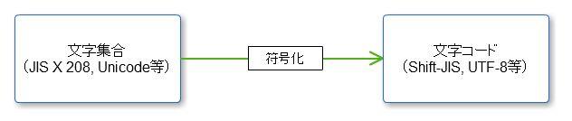
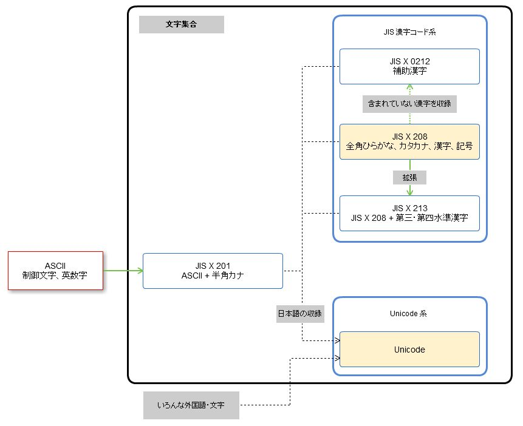

# 文字コードの話

----

### 文字コードってなぁに？

wikipedia 大先生より

	文字コード（もじコード）はコンピュータ上で文字（キャラクタ (コンピュータ)）を
    利用するために各文字に割り当てられるバイト表現。
	もしくは、バイト表現と文字の対応関係（文字コード体系）のことを指して
    「文字コード」と呼ぶことも多い。

ここでは業務で使うであろう文字コードについて扱います。
歴史的な話とか興味あれば調べてください。

文字コードという名前自体が割と広義で使われていて、  
割と曖昧な単語な気がしないでもないですが  
ここではスルーします。

---

## ASCII

* 最も基本となる文字コード
* 1文字1バイト（ほんとは7ビット）
* 制御文字＋英数字＋記号のみで構成されている

```
0x00 - 0x1F  制御文字
0x20         空白
0x21 - 0x7E  英数字と記号
0x7F         制御文字（DEL）
```

---

## 日本語に対応したい！！

 ---

### 標準となる文字集合を策定だ！

 ---

### 文字集合ってなぁに？

wikipedia 大先生より

	文字集合（もじしゅうごう、英: character set）は、
    文字（キャラクタ (コンピュータ)）をその要素（「元」）とする集合である。
    文字セットという場合もある。

 ---

分かりやすくいうと以下のような感じ



---

## 文字集合

 ---

### JIS X 0201

* ASCII + 半角カナ
* ASCIIの8ビット目を1にしてカタカナを割り当てている

```
0x00 - 0x7F  ASCII 領域
0xA1 - 0xDF  JISカナ(半角カナ)
```

 ---

### JIS X 0208

* JIS X 0201 + 全角ひらがな、カタカナ、記号、漢字
* 文字に区と点の番号が振られている

```
 01区～08区  JIS X 0201 領域
 09区～15区  未定義（機種依存）
(13区        NEC拡張外字)
 16区～47区  JIS第一水準漢字
 48区～84区  JIS第二水準漢字
 85区～94区  未定義（機種依存）
(89区～92区  NEC拡張外字)
```

 ---

### Unicode

* 世界で使われる全ての文字を共通の文字集合にて利用できるようにしようという考え
* その影響でめちゃめちゃ範囲が広い
* 日本語からは JIS X 0201・JIS X 0208・JIS X 0212・JIS X 0213 の内容を収録している
* 文字にコードポイント（Unicodeスカラ値）と呼ばれる番号が振られている
* U+0000 ～ U+FFFF の4桁で表す（追加領域は5～6桁　顔文字、麻雀牌とかトランプとかある）
* 符号化の方法も言及されている

```
U+0000 - U+007F  ASCII 領域
U+0080 - U+00FF  ラテン1補助
・・・
U+3040 - U+309F  ひらがな
U+30A0 - U+30FF  カタカナ
```

 ---

### その他の文字集合

説明は割愛するので興味ある人は調べてみてください。

* JIS X 0212(補助漢字 JIS X 0208と組み合わせて使う)
* JIS X 0213(JIS X 0208の拡張、完全上位互換ではない）
* JIS X 0221
* iモード絵文字·EZweb絵文字·SoftBank絵文字
* 今昔文字鏡（こんじゃくもじきょう）
* JIPS（NEC開発）
* EBCDIC（アメリカIBM 汎用コンピュータ）
* GT書体（東京大学多国語処理研究会）
* KEIS（日立）
* IBM漢字システム（IBM DOS/V機）
* CID（Adobe)

---

### 覚えておけばいいのは以下2つ

 ---

#### JIS 漢字コード

* JIS X ～
* 文字に区と点の番号が振られている
* この番号を一定のルールで符号化したのがShift_JISとかEUC-JP等
* 符号化のルールが違うだけで指している番号は同じ

 ---

#### Unicode

* 文字にコードポイント（Unicodeスカラ値）と呼ばれる番号が振られている
* 符号化方式も策定されている
* これを符号化したのがUTF-8とかUTF-16等

---

### ここまでまとめ



 ---

図を見ると「JIS X 0208 + JIS X 0213 = JIS X 0213」のように見えますが、
漢字の採用基準が違うので収録している漢字に差異があります。

---

### 執筆中