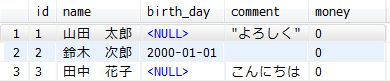
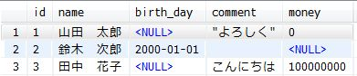

# はじめに

ファイルを MySQL に取り込む方法はパッと思いつく感じ大体以下の2パターンになると思います。

1. 何らかの言語を使ってCSVを1行ごとに読み込んでINSERTする（PHPとか）
2. LOAD DATA INFILE 構文を使う

この** 2番の方法はとっても高速 **です。
どのくらい早いかというと某案件で** 約250万件のレコードを移行** する必要があり、
PHPを使って処理したところ** 約20時間ほど **かかっていたのが
2番の方法に変更したら** 大体3分ほど **で取り込みが完了しました。

というわけで今回はこの2番の方法の話をしたいと思います。

# LOAD DATA IN FILE構文

[公式リファレンスより](https://dev.mysql.com/doc/refman/5.6/ja/load-data.html)
LOAD DATA IN FILE 構文は以下の通りです。

```
LOAD DATA [LOW_PRIORITY | CONCURRENT] [LOCAL] INFILE 'file_name'
    [REPLACE | IGNORE]
    INTO TABLE tbl_name
    [PARTITION (partition_name,...)]
    [CHARACTER SET charset_name]
    [{FIELDS | COLUMNS}
        [TERMINATED BY 'string']
        [[OPTIONALLY] ENCLOSED BY 'char']
        [ESCAPED BY 'char']
    ]
    [LINES
        [STARTING BY 'string']
        [TERMINATED BY 'string']
    ]
    [IGNORE number {LINES | ROWS}]
    [(col_name_or_user_var,...)]
    [SET col_name = expr,...]
```

上記の通り結構色んなオプションがあり、
それを全部説明していたらきりがないので Windows の Excel で作成した CSVファイルということで話を進めます。


# Excel の CSV の仕様

何も考えずに Excel で CSV を作成すると以下のような仕様になります。

* 改行コードは CRLF
* 文字コードは CP932
* データの区切りはカンマ
* 文字列は " で囲み、レコード中に " が含まれていた場合は "" とする
* 数字に勝手にカンマが入ったり等

Excel に限らず MS製のソフトを使ってCSVを出そうとすると大抵上記のような仕様となります。
（ACCESSのCSVエクスポート等）


例えば上記のような形で CSV を保存すると以下のようになります。

```
ID,名前,生年月日,一言コメント,所持金
1,山田　太郎,,"""よろしく""",\0
2,鈴木　次郎,2000/1/1,,
3,田中　花子,,こんにちは,"\100,000,000"
```

上記のCSVを以下のようなテーブルに取り込むことを考えます。
（テーブル側の文字コードはUTF-8）

```
DROP TABLE IF EXISTS t_import;
CREATE TABLE t_import (
  id        INTEGER       NOT NULL              COMMENT 'ID',
  name      VARCHAR (255) NOT NULL DEFAULT ''   COMMENT '名前',
  birth_day DATE                   DEFAULT NULL COMMENT '生年月日',
  comment   VARCHAR (255) NOT NULL DEFAULT ''   COMMENT '一言コメント',
  money     INTEGER                DEFAULT NULL COMMENT '所持金',

  PRIMARY KEY ( id )
) ROW_FORMAT=DYNAMIC COMMENT='取り込み';
```

# クエリ

結論から先に書くと先ほど生成した CSV は以下のクエリで取り込めます。

```
SET character_set_database=cp932;

LOAD DATA LOCAL INFILE 'test.csv' INTO TABLE t_import
 FIELDS
  TERMINATED BY ','
  ENCLOSED BY '"'
  ESCAPED BY ''
 LINES TERMINATED BY '\r\n'
 IGNORE 1 LINES
 (id, name, birth_day, comment, money);
```

## SET character_set_database=cp932;

CSV の文字コードはCP932なのでそのまま取り込んだ場合文字化けが発生します。
LOAD DATA INFILE 構文は `character_set_database` の値を見に行くので、その文字コードを一時的に変えてやります。
実は文字コードを変えずとも登録処理はできていたりするのですが、データは当然おかしいことになっています。

## FIELDS

### TERMINATED BY ','

データがカンマ区切りであることを明示します。
これを指定しない場合、`FIELDS TERMINATED BY '\t'` (タブ区切り)を指定したのと同様になります。
TSV ファイルを読む場合はデフォルトでOKです。

### ENCLOSED BY '"'

データがダブルクォーテーションマークで囲まれていることを明示します。
が、** 必ずデータすべてがこの記号で囲まれている必要はなく、 **
データの先頭がこの記号で始まっている場合にのみデータの終了がこの記号までというような形になります。

更にデータ中にこの記号を含めたい場合は、2文字分この記号を記述することで、
1文字分の記号として表現することができます。

|CSVデータ | 取り込み後データ |
|:--------|:-----------------|
|あい"う"えお|あい"う"えお|
|"あいう""う""えお"|あい"う"えお|
|あい""う""えお|あい""う""えお|

これを指定しない場合、`FIELDS TERMINATED BY ''` (囲み文字なし)を指定したのと同様になります。

### ESCAPED BY ''

エスケープ文字を指定します。
今回取り込むCSVファイルはエスケープ文字が特にないので空文字を指定します。
これを指定しない場合、`ESCAPED BY '\\'` (バックスラッシュ)を指定したのと同様になるので、
** \0 のデータがASCIIのNULL文字として扱われてしまいます **。

**1点実はこれを指定しないことに問題があって**、
エスケープ文字がデフォルトの場合、`\N` を NULL として扱うのですが、
エスケープ文字を空文字とすると囲み記号がない`NULL`という文字列の場合にNULLとして扱ってしまいます。
（`"NULL"` の場合は NULL という文字列で入る）

なので、このNULLという文字列で値が入る場合何らかの工夫が必要になってきます。
（全く使われていない記号をエスケープ文字にする、NULLというデータをダブルクォートで囲む等）

## LINES TERMINATED BY '\r\n'

1行の区切り文字を指定します。
これを指定しない場合、`LINES TERMINATED BY '\n'` (LF)を指定したのと同様になります。
改行コードがCRLFにも関わらず指定しない場合、最後の列に\rが紛れ込むことになります。

## IGNORE 1 LINES

先頭から指定された数値文、読み込みをスキップします。
今回取り込む CSV は1行目のデータがヘッダ行になっているので、1行目をスキップします。

# 変数を使う

今回取り込んだCSVの結果は下の画像の通りです。



ある程度思い通りに取り込めてはいるのですが、以下のようなエラーが出ています。
（エラーを表示させるには LOAD DATA IN FILE を行なった直後のクエリで `SHOW WARNINGS` を実行する必要あり）

```
+---------+------+---------------------------------------------------------------------+
| Level   | Code | Message                                                             |
+---------+------+---------------------------------------------------------------------+
| Warning | 1265 | Data truncated for column 'birth_day' at row 1                      |
| Warning | 1366 | Incorrect integer value: '\0' for column 'money' at row 1           |
| Warning | 1366 | Incorrect integer value: '' for column 'money' at row 2             |
| Warning | 1265 | Data truncated for column 'birth_day' at row 3                      |
| Warning | 1366 | Incorrect integer value: '\100,000,000' for column 'money' at row 3 |
+---------+------+---------------------------------------------------------------------+
```

更に、money の列に意図した結果が入っていません。
（STRICTモードではこういったデータはこけてほしいのだが、なぜかデータの投入自体はできている。
　さらっとしか調べてないのですが、[この辺り](http://yoku0825.blogspot.jp/2014/08/load-data-local-infile.html)が原因？）

これらのエラーを回避するためには以下のような挙動にする必要があります。

* birth_day に取り込むデータが空文字の場合は NULL として登録
* money に取り込むデータが空文字の場合は NULL として登録
* money に取り込むデータの不要な記号を除去

と、言うわけでクエリを以下のように書き換えてやります。

```
SET character_set_database=cp932;

LOAD DATA LOCAL INFILE 'test.csv' INTO TABLE t_import
 FIELDS TERMINATED BY ',' ENCLOSED BY '"' ESCAPED BY ''
 LINES TERMINATED BY '\r\n'
 IGNORE 1 LINES
(id, name, @var_birth_day, comment, @var_money)
SET
 birth_day = NULLIF(@var_birth_day, ''),
 money = NULLIF(REPLACE(REPLACE(@var_money, '\\', ''), ',', ''), '')
;
```

ここで注目するのは () 内の @変数と、その後のSET句です。
@変数内にCSVのデータを一時的に突っ込んでおいて、
その後のSET句で空文字の場合はNULLにする関数及び、記号の除去を行なっています。
（TRIM とかしてもいいかも）
登録日などの `NOW()` を固定で入れたい列がある場合もこのSET句で行なうことができます。

このクエリを実行した結果が以下の通りです。



意図したとおりの結果になっています。

# まとめ

というわけで、そこまで複雑にならずかつ高速にINSERT処理を行なうことができます。
割とニッチな需要だと思いますが、INSERT処理がボトルネックになるような場面があったら、
ぜひLOAD DATA INFILE構文の使用を検討してみてください。