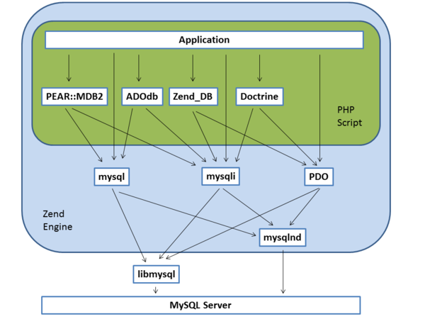

# はじめに

PHP で設定された利用可能な最大メモリ使用量を超えると以下のエラーが出ます。

```
Fatal error: Allowed memory size of xxxxx bytes exhausted
```
PHP を書いたことがある人なら、大抵上のようなエラーを見たことがあると思います。
（大きいデータを扱って動作確認したことない人はともかく）


# 前提

今回はでかいテーブルがあってそれを全件なんとかするという前提で話を進めます。
さくっとテーブル作って100万件くらいのデータ用意します。

```sql
DROP DATABASE IF EXISTS sample_database;
CREATE DATABASE sample_database;
USE sample_database;

CREATE TABLE sample_table (
    id INT PRIMARY KEY AUTO_INCREMENT,
    moji VARCHAR(32)
);

INSERT INTO sample_table () VALUES ();
INSERT INTO sample_table (id) SELECT 0 FROM sample_table; --2行になる
INSERT INTO sample_table (id) SELECT 0 FROM sample_table; --4行になる
INSERT INTO sample_table (id) SELECT 0 FROM sample_table; --8行になる
-- 20回繰り返すと大体100万行になる

UPDATE sample_table SET moji = MD5(RAND()); -- ランダムな値に更新
```

これをPHPで何も考えずに全件取ってみます。

```php
<?php
$db = new PDO('mysql:host=localhost;dbname=sample_database', 'root', '');
$stmt = $db->query("SELECT * FROM sample_table");
$rowset = $stmt->fetchAll(PDO::FETCH_ASSOC);
```

当然ですがエラーになります。

```
Fatal error: Allowed memory size of 134217728 bytes exhausted (tried to allocate 32 bytes)
```

というわけでこれの対処方法を考えて見ます。


# メモリ上限を増やす

割と安易な対応方法ですが、状況によっては有効かもしれません。
例えば今後ほとんどレコード数が増えることがなく、メモリがぎりぎりのところで足りないとか対処療法としてとりあえずメモリ上限増やして別の方法を後から実装するとかならいいと思います。

### php.ini

以下を変更する。

```
memory_limit = 128M
```

### ソースコード上

以下を追記する。

```php
<?php
ini_set('memory_limit', '128M');
```

# SELECT INTO OUTFILE 構文を使う

SELECT INTO OUTFILE 構文を使うとSELECTの結果をファイルに出力することができます。
1行や1レコードの区切り文字も指定できるので単純にCSV作ったりしたい場合はすごく楽です。

** CSVファイルを出力するサンプル **

```sql
SELECT * INTO OUTFILE 'filename.csv'
  FIELDS TERMINATED BY ',' OPTIONALLY ENCLOSED BY '"'
  LINES TERMINATED BY '\n'
  FROM sample_table WHERE id < 10000000;
```

ところが例えば 性別コード といった列を持っていて、CSVを出力するときには 1の場合は男性、2の場合は女性といったデータを出力したい場合、SELECT文中にCASE文を書いたりファイル出力後に1行ずつ読み込んで処理するといった方法もできなくはないですがあまりスマートではないかなと思います。というわけで次の方法。

# 1行ずつ処理する

1回クエリ投げてPHP側から1行ずつ処理するような方法を取ります。SQL のカーソルとほぼ同一だと思いますが、厳密には違うんじゃないかなぁと個人的に思っています。

### 環境

* PHP ･･･ 5.6.11
* Extension ･･･ mysqlnd

### 実行コード

```php
<?php
$db = new PDO('mysql:host=localhost;dbname=sample_database', 'root', '');
$stmt = $db->query("SELECT * FROM sample_table");

while (true) {
    $row = $stmt->fetch(PDO::FETCH_ASSOC);

    // ～～～ 簡略化のため4件目で終わり ～～～
    if(! $row || $row['id'] == 4) {
        break;
    }

    // ～～～ 何らかの処理 ～～～
    echo $row['id'] . " : " .$row['moji'] . "\n";
}
```

### 実行結果

```
Fatal error: Allowed memory size of 134217728 bytes exhausted (tried to allocate 32 bytes)
```

1行ずつ取得しているはずなのに、結局メモリオーバーエラーで落ちます。

なぜかというとバッファモードと非バッファモードというものがありデフォルトではバッファモードで動いています。バッファモードには以下の特徴があります。（公式より抜粋）

```
クエリの結果がすぐに MySQL サーバーから PHP に転送され、
PHP プロセスのメモリ内に結果を保持し続けるということです。
これで、その後で行数を数えたり結果ポインタを移動 (シーク) したり
といった操作ができるようになります。
```

つまりクエリを実行した時点で結果がすべてPHPのメモリ上に展開されるような処理がデフォルトになっているということです。一方非バッファモードには以下の特徴があります。（公式より抜粋）

```
クエリを実行してリソースを返しますが、
その時点ではまだデータが MySQL サーバー上にあって取得待ちになっています。
```

というわけで非バッファモードに変更してやります。

```php
$db->setAttribute(PDO::MYSQL_ATTR_USE_BUFFERED_QUERY, false);
```

ZendFramework だと以下のような感じです。

```php
$db = new Zend_Db_Adapter_Pdo_Mysql($config);
$db->getConnection()->setAttribute(PDO::MYSQL_ATTR_USE_BUFFERED_QUERY, false);
```

というわけで非バッファモードに変更して実行してみます。

### 実行コード

```php
<?php
$db = new PDO('mysql:host=localhost;dbname=sample_database', 'root', '');
$db->setAttribute(PDO::MYSQL_ATTR_USE_BUFFERED_QUERY, false); // 非バッファモードに変更
$stmt = $db->query("SELECT * FROM sample_table");

while (true) {
    $row = $stmt->fetch(PDO::FETCH_ASSOC);

    // ～～～ 簡略化のため4件目で終わり ～～～
    if(! $row || $row['id'] == 4) {
        break;
    }

    // ～～～ 何らかの処理 ～～～
    echo $row['id'] . " : " .$row['moji'] . "\n";
}
```

### 実行結果

```
1 : 5fb91565927db0b9f49e87ceb339d0c2
2 : ab5ea8e551e8bf1b840743b05c7675c1
3 : 5a55abe1024f96813ea2cf598befd08a
```

というわけで期待した動作となりました。


## 実は使ってる拡張によって挙動が違う

先ほどエラーとなったコードを今度はlibmysqlな環境で試してみます。

### 環境

* PHP ･･･ 5.4.40
* Extension ･･･ libmysql

### 実行コード

```php
<?php
$db = new PDO('mysql:host=localhost;dbname=sample_database', 'root', '');
$stmt = $db->query("SELECT * FROM sample_table");

while (true) {
    $row = $stmt->fetch(PDO::FETCH_ASSOC);

    // ～～～ 簡略化のため4件目で終わり ～～～
    if(! $row || $row['id'] == 4) {
        break;
    }

    // ～～～ 何らかの処理 ～～～
    echo $row['id'] . " : " .$row['moji'] . "\n";
}
```

### 実行結果

```
1 : 5fb91565927db0b9f49e87ceb339d0c2
2 : ab5ea8e551e8bf1b840743b05c7675c1
3 : 5a55abe1024f96813ea2cf598befd08a
```

今度は正しく取ることができました。実は libmysql は PHP の外でメモリを使っていて結果を PHP の変数に代入するまでは PHP 側のメモリ使用量にカウントされない為、バッファクエリモードでも正しく動作します。（但しOS側のメモリを使って結果をドンッとメモリに乗せていることは変わらないので、OOM Killerとか cannot allocate memory は気にしないといけないです）



※画像は[こちら](http://d.hatena.ne.jp/do_aki/20111214/1323831558)より転用させていただきました。

上記の図の通り、mysqlnd は ZendEngine の中で、libmysql は外で動作しています。なのでメモリの管理が変わるということですね。

ちなみに mysqlnd はPHP5.3から登場し、5.4からはデフォルトになっています（5.3はコンパイルのときに明示する必要があった）。
今後は mysqlnd で製造する機会の方が多くなると思うのでこの話は参考程度に留めてください。

## 非バッファモードの制約

1点気をつけないといけないのが非バッファクエリモードで結果を1行ずつ処理している最中に以下の2点のどちらかを満たさないと別のクエリを投げた場合うまく動作しません。

* fetch() で全件取った後
* カーソルを閉じる

### 実行コード

```php
<?php
$db = new PDO('mysql:host=localhost;dbname=sample_database', 'root', '');
$db->setAttribute(PDO::MYSQL_ATTR_USE_BUFFERED_QUERY, false); // 非バッファモードに変更
$stmt = $db->query("SELECT * FROM sample_table");

while (true) {
    $row = $stmt->fetch(PDO::FETCH_ASSOC);

    // ～～～ 簡略化のため4件目で終わり ～～～
    if(! $row || $row['id'] == 4) {
        break;
    }

    // ～～～ 何らかの処理 ～～～
    echo $row['id'] . " : " .$row['moji'] . "\n";

    // 結果を使って何かする
    $stmt2 = $db->query("SELECT 1");
    if($stmt2 === false) {
        die("2つ目のクエリで失敗");
    }

    $stmt2->execute();
}
```

### 実行結果

```
1 : 5fb91565927db0b9f49e87ceb339d0c2
2つ目のクエリで失敗
```

取ってきた値を使ってDBに対して何かしようとする場合、別の方法を考えないといけないです。


# 最終手段

* 処理中に別のクエリを投げたい
* 一時ファイル等に結果を吐き出して処理はNG

こんな状況は滅多にないと思いますが、最終手段としてメモリエラーにならない範囲で LIMIT 切ってしまうのもありなんじゃないかなぁと思います。（極力やりたくないですが）

### 1000件ずつ処理するサンプルコード

```php
<?php
$db = new PDO('mysql:host=localhost;dbname=sample_database', 'root', '');

$limit = 1000;
$last_id = 0;

$db->beginTransaction();
try {
    while (true) {
        $stmt = $db->query("SELECT * FROM sample_table WHERE id > {$last_id} ORDER BY id LIMIT {$limit}");

        $rowset = $stmt->fetchAll(PDO::FETCH_ASSOC);

        if(! $rowset) {
            break;
        }

        foreach($rowset as $row) {
            // ～～～ 何らかの処理 ～～～

            // 次回のクエリはidの最後の値からスタートするようにする
            $last_id = $row['id'];
        }
    }

    $db->commit();
} catch (Exception $ex) {
    $db->rollBack();
    throw $ex;
}
```

主キーを元に順番に処理していくイメージです。
LIMIT ～ OFFSET ～ でも同様のことができますが、OFFSET は最初から読み込んで捨てる動作となるのでパフォーマンスがよくないです。

また、この時トランザクションをかけていますが、SELECT の結果と UPDATE 内容の一貫性を保ちたい場合トランザクション分離レベルとファントムリードを気にしないといけません。~~MySQLのデフォルトの状態ではREPEATABLE READで、MySQLに限りREPEATABLE READでもファントムリードは発生しないので気にしなくてもいいっちゃいいのですが。~~と、思っていたのですが直列化可能ではないので読み込みが巻き戻る可能性があります。（ファントムリードが発生しないのは最初のセレクト時のスナップショットを参照しているためファントムリードが起こらないだけ）なので、一貫性を保ちたい場合は Serializable にするか SELECT FOR UPDATE が必要です。
